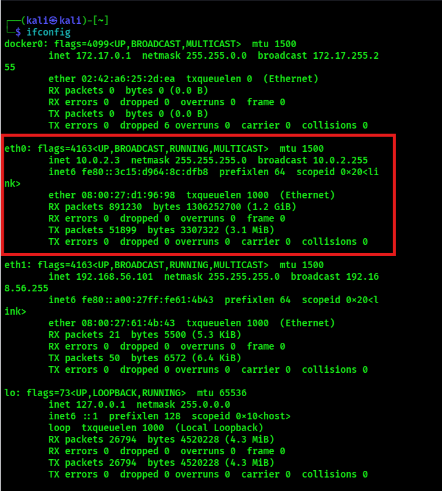
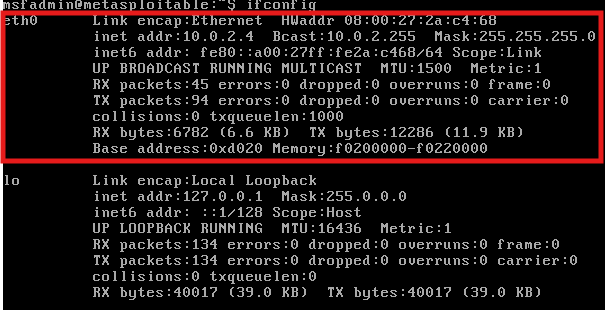
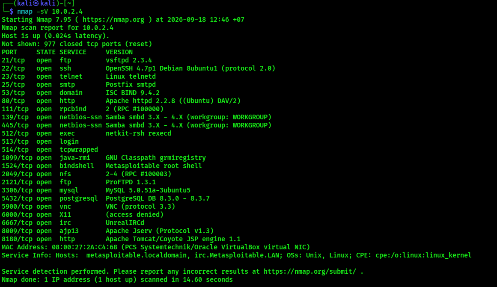

## Metasploitable 2 – UnrealIRCd Vulnerability Assessment & Exploitation Lab

## Overview

This project demonstrates a basic vulnerability assessment and controlled exploitation workflow using an intentionally vulnerable Metasploitable 2 virtual machine.

The objective was to identify exposed services, investigate a critical UnrealIRCd vulnerability, and safely test exploitation using Metasploit within an isolated virtual lab environment.

The project follows the workflow:

Network Identification → Service Enumeration → Vulnerability Identification → Vulnerability Verification → Controlled Exploitation → Shell Access

## Lab Environment

The lab was conducted using two virtual machines connected through a virtual network:

| Machine          | Purpose                           | IP Address |
| ---------------- | --------------------------------- | ---------- |
| Kali Linux       | Security testing and exploitation | `10.0.2.3` |
| Metasploitable 2 | Intentionally vulnerable target   | `10.0.2.4` |

### Network Topology

```text
┌─────────────────────┐
│     Kali Linux      │
│    10.0.2.3         │
│                     │
│ Nmap / Nessus /     │
│ Metasploit          │
└──────────┬──────────┘
           │
           │ Virtual Network
           │
┌──────────▼──────────┐
│   Metasploitable 2  │
│    10.0.2.4         │
│                     │
│ Intentionally       │
│ Vulnerable Target   │
└─────────────────────┘
```

> **Note:** The IP addresses shown above are private lab addresses used within the virtual environment.

## 1. Identify IP Addresses

The first step was to identify the IP addresses assigned to each virtual machine.

On Kali Linux, `ifconfig` was used to identify the local network configuration and confirm the Kali Linux IP address.

**Kali Linux:**

```text
10.0.2.3
```




The Metasploitable 2 machine was identified as the target system:

```text
10.0.2.4
```



These addresses were then used during the subsequent scanning and exploitation steps.

## 2. Service Enumeration with Nmap

After identifying the target IP address, Nmap was used to enumerate the services and versions exposed by the Metasploitable 2 machine.

The following command was used:

```bash
nmap -sV 10.0.2.4
```

The scan identified multiple open ports and services running on the target. The service and version information provided useful information for determining potential vulnerabilities that could be investigated further.

### Nmap Scan Results


